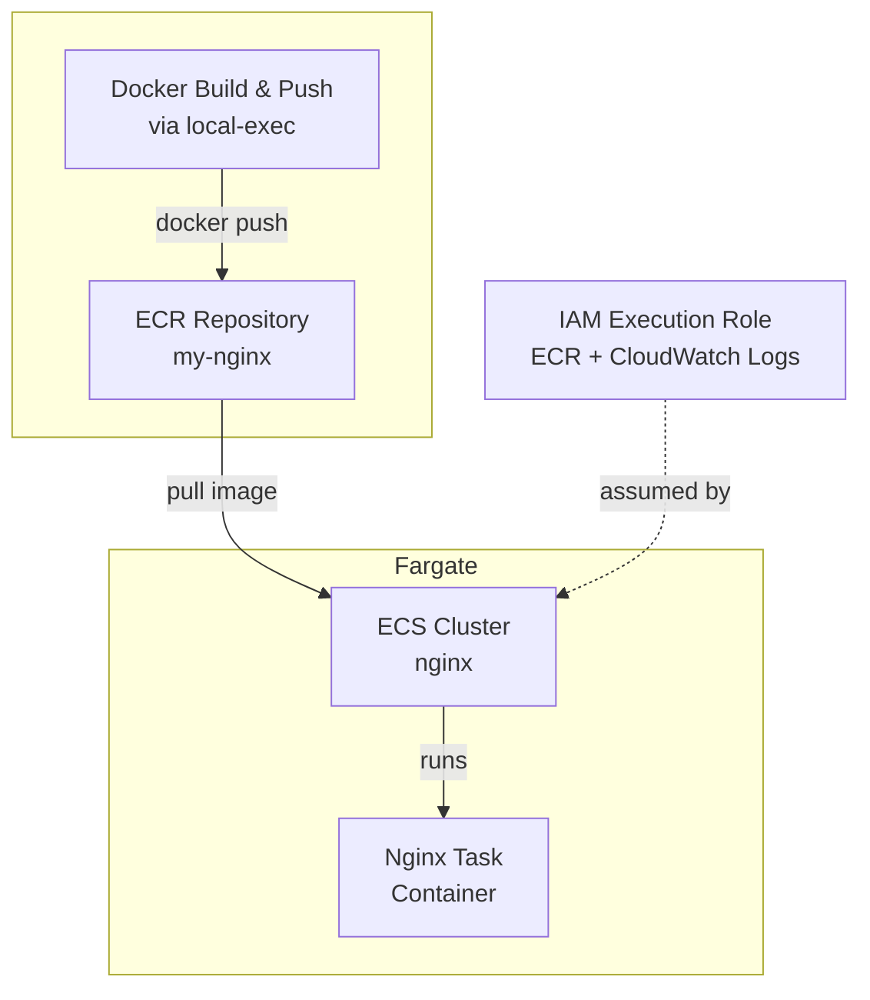

# Terraform ECS and custom image with ECR

This project provisions an ECS Fargate cluster running an Nginx container image from an ECR repository.

> [!TIP]
> The infrastructure details can be found in the `.tf` files.

## Architecture Overview



## IAM Role Explanation

The `ecsTaskExecutionRole` is **required** for Fargate tasks using ECR images:

1. **Trust Policy**: Only `ecs-tasks.amazonaws.com` can assume this role
2. **Permissions**: Via `AmazonECSTaskExecutionRolePolicy` (AWS managed):
   - Pull images from ECR (`ecr:GetAuthorizationToken`, `ecr:BatchGetImage`, etc.)
   - Write logs to CloudWatch (`logs:CreateLogStream`, `logs:PutLogEvents`)

> [!NOTE]
> The managed policy uses `Resource: "*"`, meaning it can access **any** ECR repository in your account. This is convenient but not least-privilege. See `iam.tf` comments for details.

## Requirements

1. Install [AWS CLI](https://docs.aws.amazon.com/cli/latest/userguide/getting-started-install.html)
2. Install [Terraform CLI](https://developer.hashicorp.com/terraform/install)
3. Docker installed locally (for building and pushing the image)

## How to execute

### Create and setup resources

1. Log in to AWS
    ```
    aws login
    ```

0. Initialize Terraform
    ```
    terraform init
    ```

0. Create all AWS resources
    ```shell
    terraform apply
    ```

### Delete all resources

```shell
terraform destroy
```