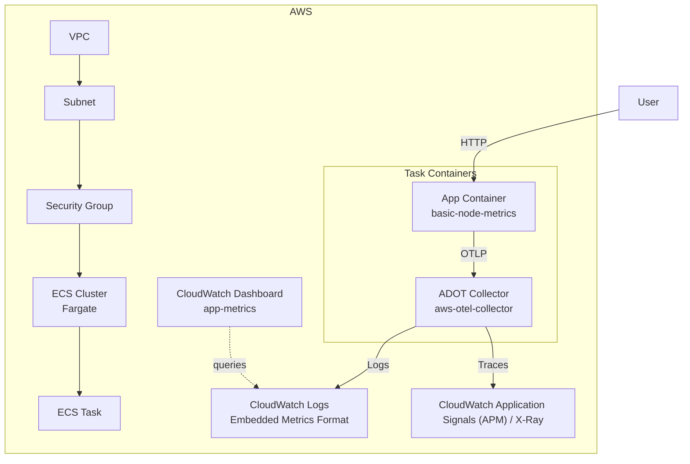
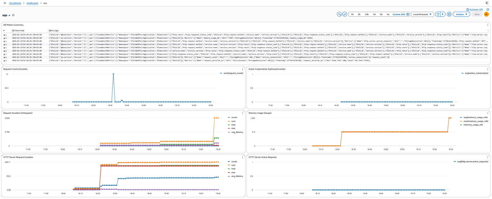

# Terraform ECS with OpenTelemetry Metrics and Tracing

This project provisions an ECS Fargate cluster running a Node.js application with integrated OpenTelemetry metrics and distributed tracing using the AWS Distro for OpenTelemetry (ADOT) Collector.

## Architecture Overview



> [!TIP]
> The infrastructure details can be found in the `.tf` files.

## How It Works

This module deploys a sidecar pattern where two containers run together in a single ECS task:

1. **Application Container** (`basic-node-metrics`): A Node.js app that exposes HTTP endpoints for generating OpenTelemetry metrics and traces. It sends telemetry data to the ADOT collector via OTLP (OpenTelemetry Protocol) over HTTP.

2. **ADOT Collector** (`aws-otel-collector`): The AWS Distro for OpenTelemetry Collector receives telemetry from the app and exports it to AWS services.

### Metrics Collection

> [!IMPORTANT]
> **Metrics are exposed via CloudWatch Logs Insights, NOT as CloudWatch Metrics.**

The ADOT Collector uses the **Embedded Metrics Format (EMF)** to send metrics to CloudWatch Logs. This is the default behavior of the `aws-otel-collector` when running on ECS with the default configuration (`ecs-default-config.yaml`). 

This means:
- Metrics are written to CloudWatch Logs in a structured JSON format
- You query metrics using **CloudWatch Logs Insights** queries
- The CloudWatch Dashboard uses Logs Insights queries to visualize metrics
- Metrics do NOT appear in the CloudWatch Metrics console

This approach is lightweight and cost-effective for Fargate workloads, as it avoids the need for the CloudWatch agent or direct API calls to put metrics.

### Tracing

Distributed traces are sent to **AWS X-Ray** and can be viewed through **CloudWatch Application Signals (APM)** for visualization and analysis. You can view traces in either the CloudWatch Application Signals console.

### CloudWatch Dashboard

This module creates a CloudWatch Dashboard named `app-metrics` with the following visualizations:

- **Request Count (Counter)**: Sum of counter metrics over time
- **Active Connections (UpDownCounter)**: Average of up/down counter values
- **Request Duration (Histogram)**: Latency statistics (count, sum, max, min, avg)
- **Memory Usage (Gauge)**: Current memory consumption
- **All Metrics Summary**: Raw log entries for debugging

<details>
<summary>📸 Dashboard (Image)</summary>



</details>

## Application Endpoints

Once deployed, the application exposes the following endpoints:

### Metrics Endpoints

| Endpoint | Type | Description |
|----------|------|-------------|
| `/metric/counter?value=1` | Counter | Increments by value (default: 1) |
| `/metric/updown?value=1` | UpDownCounter | Add/subtract values |
| `/metric/histogram?value=100` | Histogram | Record duration values |
| `/metric/gauge?value=512` | Gauge | Set current value |

### Trace Endpoints

| Endpoint | Description |
|----------|-------------|
| `/trace/basic` | Simple span |
| `/trace/complex` | Multiple spans |
| `/trace/errored` | Error span |

## IAM Roles

Two IAM roles are configured:

- **Execution Role**: Allows Fargate to pull images and create CloudWatch log streams
- **Task Role**: Allows the ADOT collector to write logs and send traces to X-Ray

## Requirements

1. Install [AWS CLI](https://docs.aws.amazon.com/cli/latest/userguide/getting-started-install.html)
2. Install [Terraform CLI](https://developer.hashicorp.com/terraform/install)

## How to Execute

### Create and Setup Resources

1. Log in to AWS
    ```
    aws login
    ```

2. Initialize Terraform
    ```
    terraform init
    ```

3. Create all AWS resources
    ```shell
    terraform apply
    ```

4. Get the public IP of the running task
    ```shell
    aws ecs list-tasks --cluster app-cluster --region ap-south-1 --query 'taskArns[0]' --output text | \
    xargs aws ecs describe-tasks --cluster app-cluster --region ap-south-1 --tasks --query 'tasks[0].attachments[0].details[?name==`networkInterfaceId`].value' --output text | \
    xargs aws ec2 describe-network-interfaces --region ap-south-1 --network-interface-ids --query 'NetworkInterfaces[0].Association.PublicIp' --output text
    ```

### Generate Metrics and Traces

Once the task is running, you can generate telemetry data:

```shell
# Replace with the actual public IP from the previous step
export APP_IP=<public-ip>

# Generate counter metrics
curl "http://$APP_IP/metric/counter?value=5"

# Generate histogram metrics
curl "http://$APP_IP/metric/histogram?value=150"

# Generate traces
curl "http://$APP_IP/trace/complex"

# Generate error traces
curl "http://$APP_IP/trace/errored"
```

### View Telemetry Data

1. **Metrics**: Navigate to CloudWatch → Dashboards → `app-metrics`
   - Note: Metrics are queried from CloudWatch Logs Insights, not CloudWatch Metrics

2. **Traces**: Navigate to CloudWatch → Application Signals (APM) → Traces

3. **Raw Logs**: Navigate to CloudWatch → Logs → `/aws/ecs/application/metrics`

### Delete All Resources

```shell
terraform destroy
```

## References

- [AWS Distro for OpenTelemetry Collector](https://github.com/aws-observability/aws-otel-collector)
- [ADOT ECS Setup Documentation](https://aws-otel.github.io/docs/setup/ecs)
- [Container Insights with ADOT](https://docs.aws.amazon.com/AmazonCloudWatch/latest/monitoring/deploy-container-insights-ECS-adot.html)
- [Application Image: eduardoferro/basic-node-metrics](https://hub.docker.com/r/eduardoferro/basic-node-metrics)
