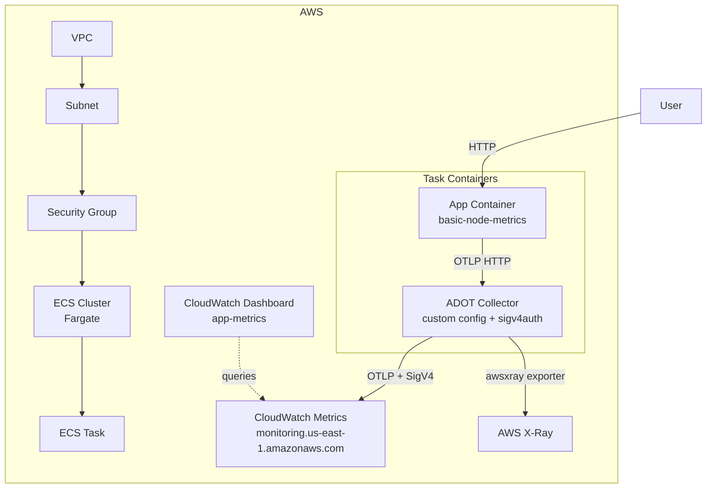

# Terraform ECS with Native CloudWatch OpenTelemetry

This project provisions an ECS Fargate cluster running a Node.js application with integrated OpenTelemetry metrics and distributed tracing using the **native AWS OTLP endpoints** (public preview).

## Architecture Overview



> [!TIP]
> The infrastructure details can be found in the `.tf` files.

## How It Works

This module deploys a sidecar pattern where two containers run together in a single ECS task:

1. **Application Container** (`basic-node-metrics`): A Node.js app that exposes HTTP endpoints for generating OpenTelemetry metrics and traces. It sends telemetry data to the ADOT collector via OTLP over HTTP (`localhost:4318`).

2. **ADOT Collector** (`aws-otel-collector`): Receives telemetry from the app and forwards it to native AWS OTLP endpoints using SigV4 authentication (via the `sigv4authextension`). The collector config is stored in SSM Parameter Store (`/app/otel-collector-config`).

### Metrics Collection

Metrics are sent via OTLP directly to the **CloudWatch native OTLP endpoint** and appear as **CloudWatch Metrics** (not CloudWatch Logs).

- Namespace: `my-service` (from the app's meter name)
- Metrics land in the CloudWatch Metrics console and can be used for alarms
- The CloudWatch Dashboard queries CloudWatch Metrics directly

> [!NOTE]
> The native CloudWatch OTLP endpoint is in **public preview** and only available in select regions: `us-east-1`, `us-west-2`, `ap-southeast-2`, `ap-southeast-1`, `eu-west-1`.

### Tracing

Distributed traces are sent to **AWS X-Ray** via the native OTLP endpoint and can be viewed through **CloudWatch Application Signals (APM)**.

### Collector Configuration

The ADOT Collector uses a custom YAML config stored in SSM Parameter Store instead of the default `ecs-default-config.yaml`. The config uses:

- `sigv4auth` extension to sign requests with the ECS task role credentials
- `otlphttp/metrics` exporter → `https://monitoring.us-east-1.amazonaws.com/v1/metrics`
- `awsxray` exporter → AWS X-Ray (standard daemon protocol, no native OTLP)

### CloudWatch Dashboard

This module creates a CloudWatch Dashboard named `app-metrics` with the following visualizations:

- **Request Count (Counter)**: Sum per minute
- **Active Connections (UpDownCounter)**: Average over time
- **Request Duration (Histogram)**: p50 / p90 / p99 latency
- **Memory Usage (Gauge)**: Average and maximum
- **HTTP Server Request Duration**: p50 / p90 / p99 (from `@hono/otel` middleware)
- **HTTP Server Active Requests**: Average active requests

## Application Endpoints

Once deployed, the application exposes the following endpoints:

### Metrics Endpoints

| Endpoint | Type | Description |
|----------|------|-------------|
| `/metric/counter?value=1` | Counter | Increments by value (default: 1) |
| `/metric/updown?value=1` | UpDownCounter | Add/subtract values |
| `/metric/histogram?value=100` | Histogram | Record duration values |
| `/metric/gauge?value=512` | Gauge | Set current value |

### Trace Endpoints

| Endpoint | Description |
|----------|-------------|
| `/trace/basic` | Simple span |
| `/trace/complex` | Multiple spans |
| `/trace/errored` | Error span |

## IAM Roles

Two IAM roles are configured:

- **Execution Role**: Allows Fargate to pull images, create CloudWatch log streams, and read SSM parameters
- **Task Role**: Allows the ADOT collector to write metrics (`cloudwatch:PutMetricData`), send traces to X-Ray, and read SSM parameters (for loading collector config)

## Requirements

1. Install [AWS CLI](https://docs.aws.amazon.com/cli/latest/userguide/getting-started-install.html)
2. Install [Terraform CLI](https://developer.hashicorp.com/terraform/install)

## How to Execute

### Prerequisites


### Create and Setup Resources

1. Log in to AWS
    ```
    aws sso login
    ```

2. Initialize Terraform
    ```
    terraform init
    ```

3. Create all AWS resources
    ```shell
    terraform apply
    ```

4. Get the public IP of the running task
    ```shell
    export APP_IP=$(aws ecs list-tasks --cluster app-cluster --region us-east-1 --query 'taskArns[0]' --output text | \
    xargs aws ecs describe-tasks --cluster app-cluster --region us-east-1 --tasks --query 'tasks[0].attachments[0].details[?name==`networkInterfaceId`].value' --output text | \
    xargs aws ec2 describe-network-interfaces --region us-east-1 --network-interface-ids --query 'NetworkInterfaces[0].Association.PublicIp' --output text)
    echo $APP_IP
    ```

### Generate Metrics and Traces

Once the task is running, you can generate telemetry data:

```shell
# Generate counter metrics
curl "http://$APP_IP/metric/counter?value=5"

# Generate histogram metrics
curl "http://$APP_IP/metric/histogram?value=150"

# Generate traces
curl "http://$APP_IP/trace/complex"

# Generate error traces
curl "http://$APP_IP/trace/errored"
```

### View Telemetry Data

1. **Metrics**: Navigate to CloudWatch → Dashboards → `app-metrics`
   - Metrics are queried from CloudWatch Metrics (namespace: `my-service`)

2. **Traces**: Navigate to CloudWatch → Application Signals (APM) → Traces

3. **Collector Logs**: Navigate to CloudWatch → Logs → `/ecs/app`

### Delete All Resources

```shell
terraform destroy
```

## References

- [Amazon CloudWatch native OpenTelemetry support](https://docs.aws.amazon.com/AmazonCloudWatch/latest/monitoring/CloudWatch-OpenTelemetry-Sections.html)
- [CloudWatch OTLP endpoint](https://docs.aws.amazon.com/AmazonCloudWatch/latest/monitoring/CloudWatch-OTLPEndpoint.html)
- [AWS Distro for OpenTelemetry Collector](https://github.com/aws-observability/aws-otel-collector)
- [Application Image: eduardoferro/basic-node-metrics](https://hub.docker.com/r/eduardoferro/basic-node-metrics)
