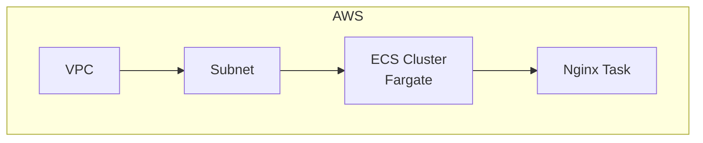

# Terraform ECS with NGINX

This project provisions an ECS Fargate cluster running an Nginx container with basic networking (VPC, subnet, security group).

## Architecture Overview



> [!TIP]
> The infrastructure details can be found in the `.tf` files.

## Requirements

1. Install [AWS CLI](https://docs.aws.amazon.com/cli/latest/userguide/getting-started-install.html)
0. Install [Terraform CLI](https://developer.hashicorp.com/terraform/install)

## How to execute

### Create and setup resources

1. Log in to AWS
    ```
    aws login
    ```

0. Initialize Terraform
    ```
    terraform init
    ```

0. Create all AWS resources
    ```shell
    terraform apply
    ```

### Delete all resources

```shell
terraform destroy
```